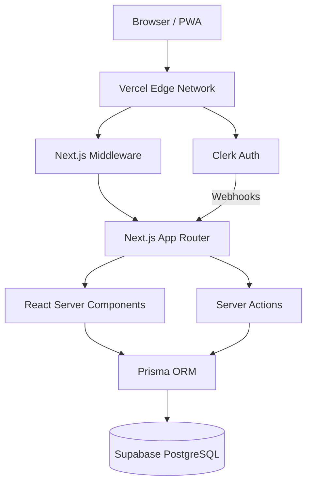

# Convoke Architecture

## System Diagram
The Convoke architecture is built on a highly optimized, edge-ready Next.js stack designed for scalability.



## Folder Structure
```text
/
├── prisma/
│   └── schema.prisma        # Database schema
├── public/                  # Static assets & PWA icons
├── src/
│   ├── app/                 # Next.js App Router
│   │   ├── api/             # Route Handlers (Webhooks)
│   │   ├── explore/         # Global feed
│   │   ├── login/           # Auth views
│   │   ├── opportunities/   # Curated board
│   │   ├── profile/         # Public portfolios
│   │   ├── spaces/          # Communities
│   │   ├── workspace/       # Authenticated dashboard
│   │   ├── layout.tsx       # Root layout
│   │   ├── page.tsx         # Landing page
│   │   └── sw.ts            # PWA Service Worker
│   ├── components/          # Reusable UI components
│   │   ├── ui/              # shadcn/ui primitives
│   │   └── ...
│   ├── lib/                 # Utilities and DB clients
│   └── middleware.ts        # Clerk auth protection
├── next.config.ts           # Next.js & Serwist config
├── package.json             # Dependencies
└── tailwind.config.ts       # Tailwind v4 configuration
```

## Rendering Strategy
- **React Server Components (RSCs)**: Default for all pages to ensure minimal JS bundle size, fast TTFB, and direct database access.
- **Client Components (`"use client"`)**: Used strictly at the leaf nodes for interactive elements (e.g., forms, carousels, nav menus).
- **Static Site Generation (SSG)**: Leveraged for the landing page and static organizational profiles.
- **Server Actions**: Used for all data mutations (form submissions, RSVPs) without requiring API routes.

## Caching & Data Fetching
- **Next.js Cache**: Aggressive route and fetch caching.
- **Revalidation**: On-demand revalidation (`revalidatePath`) triggered within Server Actions after successful mutations.
- **Direct DB Access**: Prisma queries executed directly within RSCs, eliminating the need for internal API networks.

## Authentication
- **Clerk**: Handles all auth (OAuth, OTP, Sessions) at the edge.
- **Middleware**: Intercepts requests to protect `/workspace` and admin routes.
- **Webhook Sync**: Clerk webhooks (`user.created`, `user.updated`) are caught at `/api/webhooks/clerk` and synced directly into the Supabase `User` table to maintain relational integrity.

## Storage
- **Supabase Storage** (Planned): To be used for avatars, event banners, and project attachments. Direct uploads from client via signed URLs.

## Background Jobs & Realtime
- **Background Jobs**: Currently synchronous via Server Actions. Complex tasks (e.g., email blasts) will be offloaded to Inngest or Vercel Functions.
- **Realtime**: Planned integration with Supabase Realtime for direct messaging within Spaces.

## PWA Strategy
- Built with `@serwist/next`.
- Employs `NetworkFirst` caching for HTML pages and `CacheFirst` for static assets.
- Includes full manifest and offline fallback support.

## CI/CD
- **Vercel**: Push-to-deploy from GitHub `main`.
- **Database Migrations**: Handled via Prisma locally, requiring `prisma generate` in Vercel `postinstall` to ensure the client is up to date.
