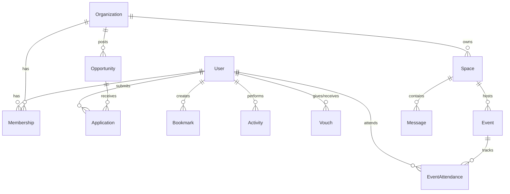

# Database Documentation

## ER Diagram Overview

Convoke uses a PostgreSQL database hosted on Supabase, managed entirely by Prisma.

## All Tables

### Core Entities
1. **`User`**: Central entity. Synced with Clerk via `clerkId`. Contains profile data (bio, handle, avatarUrl, university).
2. **`Organization`**: Represents clubs, startups, or communities. Identified by a unique `slug`.
3. **`Space`**: A community hub belonging to an Organization. Think of it as a forum or channel.
4. **`Event`**: A time-bound gathering hosted within a Space.
5. **`Opportunity`**: Roles, grants, or hackathons posted by an Organization.

### Relational & Interaction Tables
6. **`Membership`**: Join table mapping `User` to `Organization` with a specific `role` (e.g., ADMIN, MEMBER).
7. **`EventAttendance`**: Join table mapping `User` to `Event` with a `status` (e.g., GOING, INTERESTED).
8. **`Application`**: Join table mapping `User` to `Opportunity`.
9. **`Vouch`**: A peer-to-peer endorsement. Links `giverId` (User) to `receiverId` (User).
10. **`Message`**: Chat/forum messages sent by a `User` in a `Space`.
11. **`Project`**: Portfolio items created by a `User`.
12. **`Research`**: Academic/research portfolio items created by a `User`.

### Metadata & System Tables
13. **`Notification`**: In-app alerts for users.
14. **`Bookmark`**: Polymorphic table (`itemId`, `itemType`) allowing users to save events or opportunities.
15. **`Settings`**: User preferences (theme, email notifications).
16. **`Session`**: Used if NextAuth is employed, though currently superseded by Clerk.
17. **`Activity`**: Audit log of user actions.

## Key Relations & Constraints
- **Cascade Deletes**: Almost all foreign keys implement `ON DELETE CASCADE` (e.g., deleting a User deletes their Memberships, Applications, and Activity).
- **Unique Indexes**:
  - `User(email)`, `User(handle)`, `User(clerkId)`
  - `Organization(slug)`
  - `Membership(userId, organizationId)`
  - `EventAttendance(eventId, userId)`

## Unused/Future Tables
- **`Session`**: Defined in schema but currently unused since Clerk handles session tokens. Safe to remove.
- **`Activity`**: Defined but no logging mechanism currently writes to it. 

## Optimization Suggestions
1. **Indexing**: Add indexes on frequently queried fields that aren't primary/unique keys. 
   - `Event(startTime)`
   - `Message(spaceId, createdAt)`
   - `Notification(userId, read)`
2. **Polymorphic Relations**: The `Bookmark` table uses a soft polymorphic relation (`itemId`, `itemType`). While flexible, this prevents Prisma from enforcing referential integrity.
3. **Enum Refactoring**: Fields like `Opportunity.type` and `Application.status` are defined as `String`. These should be migrated to PostgreSQL `ENUM` types to guarantee data integrity.
